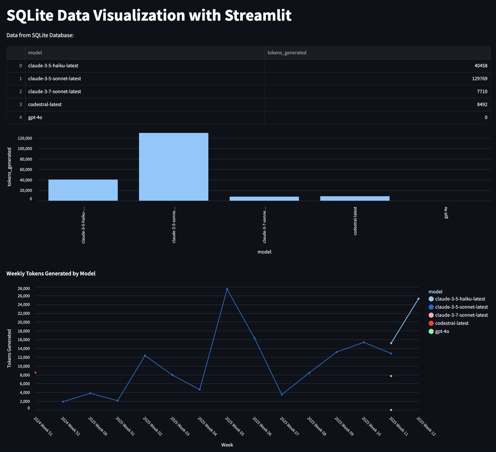

# Continue Dev Data Viz

## 1) What

This project is a simple visualization tool for the `devdata.sqlite` database that continue automaticallly generates locally on your machine, and which contains information about token generation in different models. The data includes the model name, tokens generated, and timestamp.

Here's an example visualization.


## Setup

```bash
python3 -m venv .venv
source .venv/bin/activate
uv sync
```

## Usage

```bash
source .venv/bin/activate
streamlit run viz.py
```